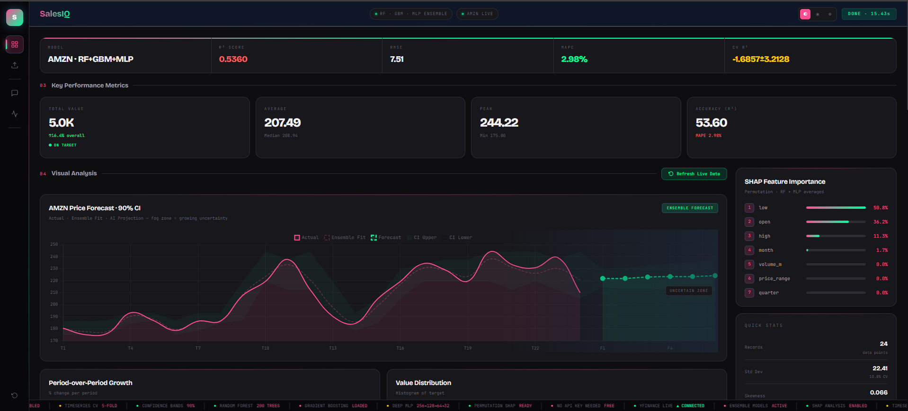

# 🚀 SalesIQ — AI Sales Forecasting & Prediction

<p align="center">
  
</p>

<p align="center">
  
  
  
  
  
</p>

<p align="center">
  <b>Real-time financial data × Ensemble ML × Explainable AI</b><br/>
  Forecast sales trends using live yfinance data, a 3-model ML ensemble, SHAP explainability & a built-in AI chat assistant — all with zero paid APIs.
</p>

---

## 📌 Table of Contents

- [About](#-about)
- [Features](#-features)
- [Demo](#-demo)
- [Tech Stack](#-tech-stack)
- [How It Works](#-how-it-works)
- [Getting Started](#-getting-started)
- [Usage](#-usage)
- [Metrics](#-metrics-tracked)
- [Project Structure](#-project-structure)
- [Contributing](#-contributing)
- [License](#-license)

---

## 📖 About

**SalesIQ** is a full-stack AI-powered forecasting dashboard that pulls **live stock & revenue data** via yfinance and trains a **3-model ensemble** to predict future trends — complete with confidence intervals, SHAP feature importance, and a conversational AI assistant built right in.

> No paid APIs. No subscriptions. Just clone and run.

---

## ✨ Features

| Feature | Description |
|--------|-------------|
| 📡 **Live Data** | Fetch real company data for Amazon, Apple, Tesla, Nvidia & more — or any custom ticker |
| 🤖 **Ensemble Models** | Random Forest + Gradient Boosting + Deep MLP (256→128→64→32) |
| 📊 **90% Confidence Intervals** | Uncertainty bands that grow realistically over the forecast horizon |
| 🔍 **SHAP Explainability** | Permutation importance to identify what actually drives predictions |
| 💬 **AI Chat Assistant** | Query your data conversationally — works fully offline |
| ⚙️ **Auto Hyperparameter Search** | TimeSeriesSplit CV across RF & GBM configurations |
| 📁 **CSV Upload Support** | Bring your own dataset — any numeric time series works |
| 🎨 **3 UI Themes** | Dark Pro, Executive Light, FinTech Blue |

---

## 🛠 Tech Stack

**Backend**
- Python 3.8+ (pure HTTP server — no Flask/Django)
- `scikit-learn` — RandomForest, GradientBoosting, MLPRegressor
- `yfinance` — live financial data
- `pandas`, `numpy` — data processing

**Frontend**
- Vanilla HTML / CSS / JavaScript
- `Chart.js` — interactive charts
- Custom CSS with CSS variables for theming

**ML Pipeline**
- `RandomForestRegressor` (200 estimators)
- `GradientBoostingRegressor`
- `MLPRegressor` (256→128→64→32, ReLU, Adam)
- `TimeSeriesSplit` cross-validation
- SHAP permutation importance

---

## 🧠 How It Works

```
User Input (Ticker / CSV)
        ↓
  Data Cleaning & Feature Engineering
        ↓
  Hyperparameter Search (TimeSeriesSplit CV)
        ↓
  Train 3 Models: RF + GBM + MLP
        ↓
  Dynamic Ensemble (R²-weighted)
        ↓
  SHAP Permutation Importance
        ↓
  Forecast + 90% Confidence Intervals
        ↓
  Interactive Dashboard + AI Chat
```

---

## ⚡ Getting Started

### Prerequisites

```bash
Python 3.8+
pip
```

### Installation

```bash
# 1. Clone the repository
git clone https://github.com/SHAIKANASBASHA-55/Salesprediction.git
cd Salesprediction

# 2. Install dependencies
pip install numpy pandas scikit-learn yfinance

# 3. Run the server
python server.py
```

### Open in Browser

```
http://localhost:8000
```

---

## 🚀 Usage

1. **Load Live Data** — Select a company (or type any ticker) and click **Fetch Live Data**
2. **Upload CSV** — Or drag & drop your own CSV file
3. **Configure** — Select target column and feature columns
4. **Run Analysis** — Click **Run Full Analysis** and watch the ensemble train
5. **Explore Results** — View forecast charts, SHAP importance, metrics & report
6. **Chat** — Ask the AI assistant anything about your data

---

## 📐 Metrics Tracked

| Metric | Description |
|--------|-------------|
| **R² Score** | % of variance explained by the model |
| **MAPE** | Mean Absolute Percentage Error |
| **RMSE** | Root Mean Squared Error |
| **MAE** | Mean Absolute Error |
| **CV R² ± std** | Cross-validation stability score |

---

## 📁 Project Structure

```
salesiq/
├── static/
│   └── index.html        # Frontend dashboard
├── uploads/              # Uploaded & fetched CSVs
├── server.py             # Backend — ML pipeline + HTTP server
└── README.md
```

---

## 🤝 Contributing

Contributions are welcome! Feel free to:

1. Fork the repo
2. Create a new branch (`git checkout -b feature/your-feature`)
3. Commit your changes (`git commit -m 'Add some feature'`)
4. Push to the branch (`git push origin feature/your-feature`)
5. Open a Pull Request

---

## 📄 License

This project is licensed under the **MIT License** — see the [LICENSE](LICENSE) file for details.

---

## 🙌 Acknowledgements

- [yfinance](https://github.com/ranaroussi/yfinance) — free Yahoo Finance data
- [scikit-learn](https://scikit-learn.org/) — ML models
- [Chart.js](https://www.chartjs.org/) — beautiful charts

---

<p align="center">
  Made with ❤️ | Give it a ⭐ if you found it useful!
</p>
